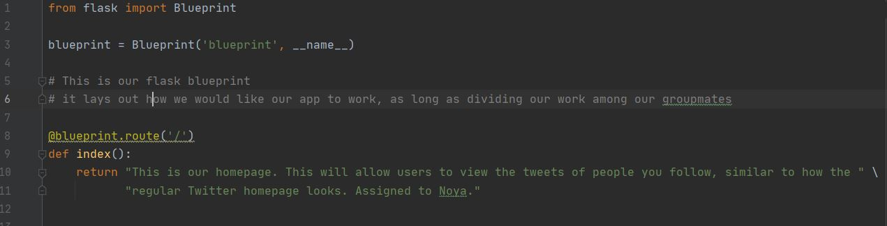
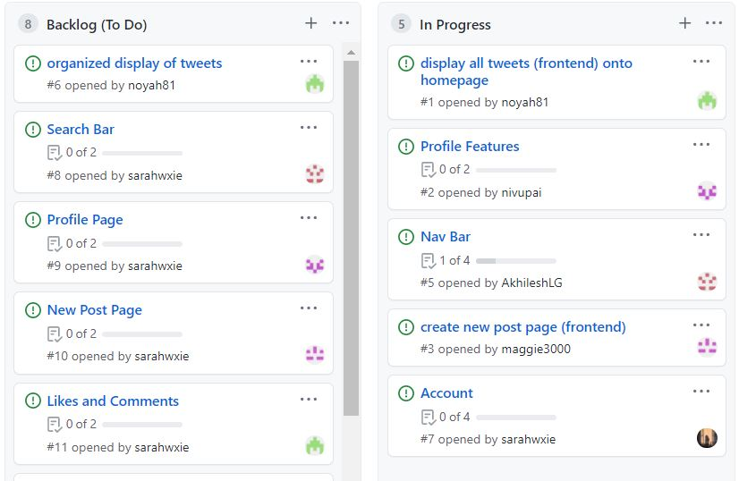

# P2 Ducks Project

Welcome to p2-ducks!
Sarah Xie, Maggie Killada, Akhil Genneri, Nivu Rethnakar, Noya Hafiz
Period 2

Runtime Link: [here](http://72.197.231.5:8080)

Scrum Board: [here](https://github.com/noyah81/p2ducks/projects/1)

Project Plan: [here](https://docs.google.com/document/d/116Wt0SjYg3Qs0tVatOE36yF8bYnRhermPScTxo2H6Kc/edit?usp=sharing)

## Project Summary
We're building a Twitter Clone for DNHS students called Hawkers!

### Tri3 Minilab
##### [Nivu Rethnakar](https://github.com/nivupai/nivu_minilab)
##### [Maggie Killada](https://github.com/maggie3000/helloworld)
##### [Noya Hafiz](https://github.com/noyah81/noyaminilab)
##### [Akhilesh Genneri](https://github.com/AkhileshLG/minilab1)
##### [Sarah Xie](https://github.com/sarahwxie/minilab)

## Main Features:

- Navbar w/ searchbar
- Create and share tweets using an account
- Edit your profile
- Retweet, following others, liking posts
- Create an account

## Blueprinting

All members of our group created the blueprints together (sharescreen via zoom). Each blueprint page represents a page that will be on our finished site, with a description of the feature, and the group member that has been assigned to the task.

## Scrum Board
All members are assigned to at least one "in progress" task, and one "backlog" task in accordance with our project plan.

